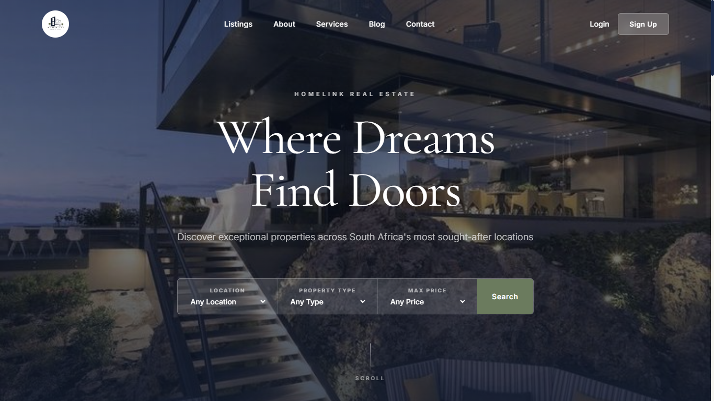
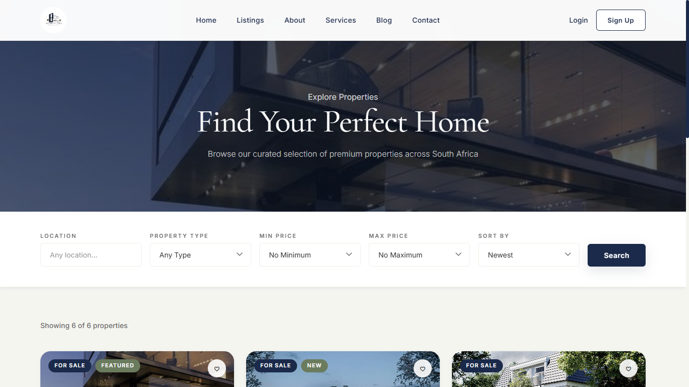
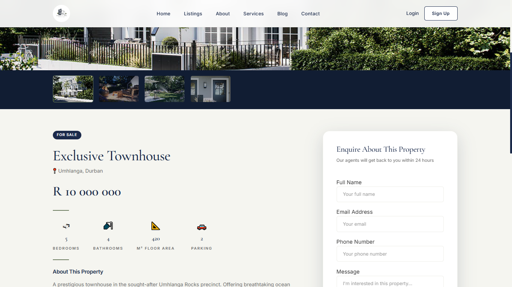
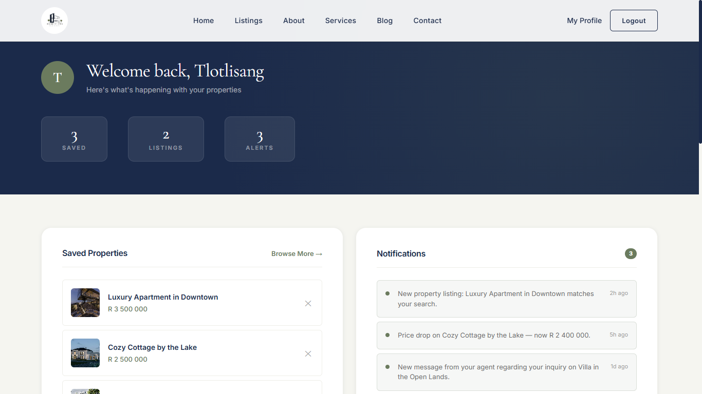

# HomeLink Real Estate Platform

> *Where Dreams Find Doors*

HomeLink is a fully responsive, premium real estate listing platform built for the South African property market. Designed as a frontend showcase project, it delivers a complete property browsing experience — from discovery to enquiry — with a polished, modern design system throughout.

---

## 🌐 Live Preview

> Coming soon — will be hosted via GitHub Pages

---

## ✨ Features

- **Property Listings** — filterable and sortable property grid with live search
- **Property Detail Pages** — full gallery with thumbnail switcher, Google Maps embed, inquiry form and social sharing
- **Smart Search** — filter by location, property type and price range
- **Blog** — searchable articles with category filtering
- **User Dashboard** — saved properties, notifications, profile settings and listings management
- **Auth Pages** — clean Login and Sign Up forms with hero backgrounds
- **About Us** — team profiles, company history, core values and contact section
- **Services** — service cards, benefits grid and interactive FAQ accordion
- **Scroll Animations** — reveal-on-scroll effects throughout
- **Sticky Filter Bars** — persistent search/filter on listings and blog pages
- **Fully consistent design system** — shared navbar, footer and CSS tokens across all pages

---

## 🛠️ Tech Stack

| Technology | Usage |
|---|---|
| HTML5 | Page structure and semantics |
| CSS3 | Styling, animations, layout (Grid & Flexbox) |
| JavaScript (Vanilla) | DOM manipulation, filtering, scroll effects, dynamic rendering |

> No frameworks. No libraries. No dependencies.

---

## 📁 Folder Structure
HomeLink/
├── HTML/
│   ├── index.html
│   ├── Login.html
│   ├── SignUp.html
│   ├── Properties.html
│   ├── property-detail.html
│   ├── AboutUs.html
│   ├── Services.html
│   ├── Blog.html
│   └── dashboard.html
├── CSS/
│   ├── global.css
│   ├── home.css
│   ├── login.css
│   ├── properties.css
│   ├── property-detail.css
│   ├── about.css
│   ├── services.css
│   ├── blog.css
│   └── dashboard.css
├── JS/
│   ├── home.js
│   ├── login.js
│   ├── signup.js
│   ├── properties.js
│   ├── property-detail.js
│   ├── about.js
│   ├── services.js
│   ├── blog.js
│   └── dashboard.js
├── images/
└── README.md

---

## 📸 Screenshots

### Homepage

### Property Listings

### Property Detail

### Dashboard

---

## 🗺️ Pages

| Page | File | Description |
|---|---|---|
| Homepage | `index.html` | Hero, search bar, featured properties, quick links, testimonials |
| Login | `Login.html` | Glassmorphism auth card over hero background |
| Sign Up | `SignUp.html` | Registration form, same design as Login |
| Property Listings | `Properties.html` | Filterable grid of all properties with pagination |
| Property Detail | `property-detail.html` | Full property view with gallery, map and enquiry form |
| About Us | `AboutUs.html` | Mission, core values, company history, team and contact |
| Services | `Services.html` | Service cards, benefits and FAQ accordion |
| Blog | `Blog.html` | Article grid with keyword search and category filter |
| Dashboard | `dashboard.html` | User panel — saved properties, notifications, profile, listings |

---

## 🚧 Planned Improvements

- [ ] Backend integration (Node.js / PHP) for real authentication
- [ ] Database for property listings and user accounts
- [ ] Individual blog post pages
- [ ] Contact form with email integration
- [ ] Mobile responsive breakpoints
- [ ] GitHub Pages deployment

---

## 👤 Author

**Tlotli Ntshabele**  
Frontend Developer  
[GitHub](https://github.com/Cloudd333)

---

## 📄 Licence

This project is open source and available under the [MIT Licence](LICENSE).